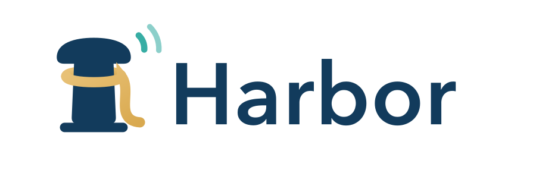
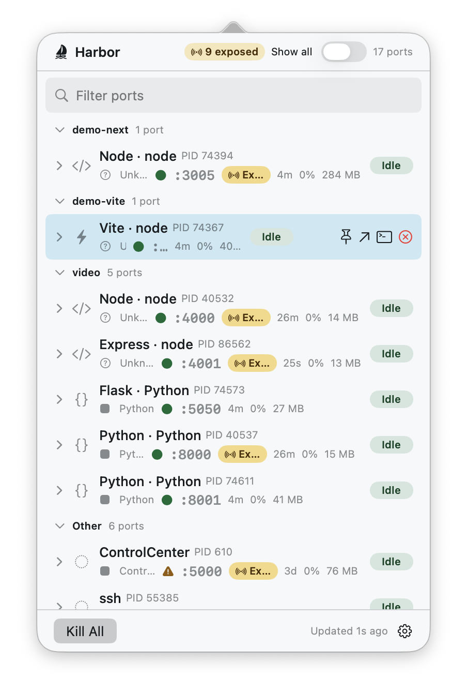
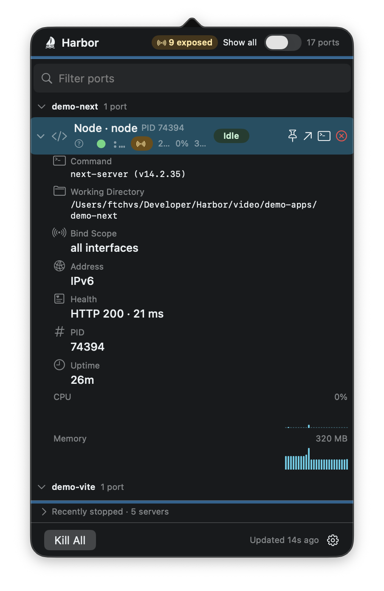
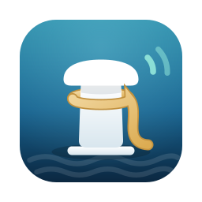

<div align="center">

<picture>
  <source media="(prefers-color-scheme: dark)" srcset="assets/readme/harbor-logo-dark.png">
  
</picture>

### Every dev server on your Mac. One keystroke away.

[](https://github.com/ftchvs/harbor/releases/latest)

-555)


[Download](https://github.com/ftchvs/harbor/releases/latest/download/Harbor.dmg) ·
[Landing page](https://ftchvs.github.io/harbor/) ·
[Changelog](CHANGELOG.md) ·
[Report an issue](https://github.com/ftchvs/harbor/issues)

</div>

---

`Error: listen EADDRINUSE: address already in use :::3000`

Something is squatting on the port. Maybe the Vite server from a project you closed two days ago. Maybe a Next.js process that survived its terminal. Harbor exists so you never paste `lsof -ti :3000 | xargs kill` again.

**Harbor is a native macOS menu-bar utility that shows every dev server listening on localhost — and lets you act on it in one keystroke.** Click the bollard in your menu bar (or hit <kbd>⌘</kbd><kbd>⌥</kbd><kbd>P</kbd> from anywhere): every listening port, the framework behind it, live CPU / memory / uptime, an energy badge when something is quietly burning your battery — and one-click kill, open-in-browser, or jump-to-terminal.

<div align="center">


*40-second teaser — [watch the full 60s demo with sound](assets/readme/harbor-hero-60.mp4)*

</div>

## What you get

| | |
|---|---|
| **Every listening port** | IPv4 + IPv6, grouped by project, with an *exposed* badge when something is bound beyond loopback — the difference between a dev server and an accidental network service. |
| **Framework detection** | Next.js, Vite, Rails, Django, Flask, Express, Astro, Remix, FastAPI, Phoenix, Spring Boot, Laravel, and more. System daemons get honest names too (AirPlay, Screen Sharing) instead of pretending to be dev servers. |
| **Live vitals** | Uptime, CPU, memory, and an energy-impact badge per server — with rolling CPU/memory bar sparklines in the detail inspector. |
| **One-keystroke actions** | Kill (SIGTERM→SIGKILL with PID-reuse protection), Kill All with enumerated confirmation, multi-select batch kill, open in browser, jump to the owning terminal (Terminal, iTerm2, Warp, Ghostty, WezTerm, kitty, Alacritty, VS Code, Cursor). |
| **Keyboard-first** | Rebindable global hotkey, arrow-key navigation, type-to-filter, Space to inspect, Esc to dismiss. Right-click the menu-bar icon for a quick menu without opening the panel. |
| **Deep visibility** | Detail inspector with full command line, working directory, owner app, bind scope, and health. Docker/Kubernetes port-forwards and tunnels (ngrok, cloudflared, `ssh -R/-L`) are labeled with their real origin. Opt-in view for UDP and stuck non-LISTEN sockets. |
| **`harbor-cli`** | `list`, `kill`, `watch`, `open` from the terminal, with a stable JSON schema for scripting. |

## Screenshots

| Light | Dark |
|:---:|:---:|
|  |  |

## Install

1. **[Download Harbor.dmg](https://github.com/ftchvs/harbor/releases/latest/download/Harbor.dmg)** (free)
2. Verify the checksum (optional, recommended):
   ```sh
   curl -LO https://github.com/ftchvs/harbor/releases/latest/download/Harbor.dmg.sha256
   shasum -a 256 -c Harbor.dmg.sha256
   ```
3. Open the DMG, drag **Harbor** to Applications, launch it from the menu bar.

Updates arrive in-app through [Sparkle](https://sparkle-project.org) with EdDSA-signed appcasts.

**Requirements:** macOS 14 (Sonoma) or later · Apple silicon or Intel.

## Private by design

Harbor never phones home. No telemetry, no accounts, no network calls except the ones you ask for (opening your server in a browser, checking for updates). The app is Developer ID signed, hardened-runtime, notarized by Apple, and every release ships with a published SHA256.

Harbor is **not sandboxed, by necessity** — it inspects and signals other processes on your machine, which the App Sandbox forbids. That is also why it is distributed here and not on the App Store.

## The bollard



Harbor's mark is a mooring bollard with a rope — the thing a harbor actually uses to hold vessels safely in place, the way Harbor holds your dev servers in view. The sea-glass arcs are a live, listening port. Deliberately not an anchor, and deliberately not a container.

Read the full launch story on [ftchvs.com](https://www.ftchvs.com/blog/harbor-1-0-release).

<br clear="left">

## Credit

Harbor is a native reimagining inspired by [Ports](https://www.ports-app.com), a free macOS menu-bar utility for viewing local dev servers. Harbor is an independent implementation and is not affiliated with or endorsed by the Ports project.

## License

Harbor is proprietary software, © 2026 Felipe Tavares Chaves. This repository hosts the distribution artifacts — releases, landing page, release notes, and update feed. The source code is not published here. See [LICENSE](LICENSE).
